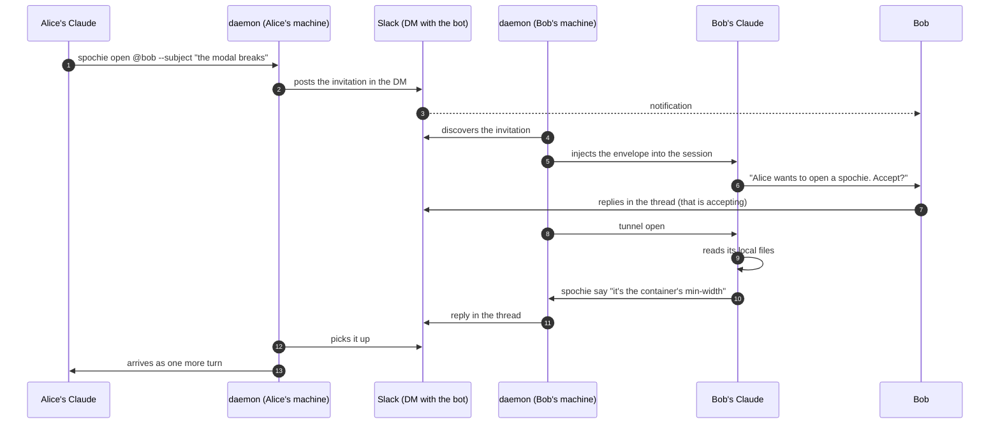
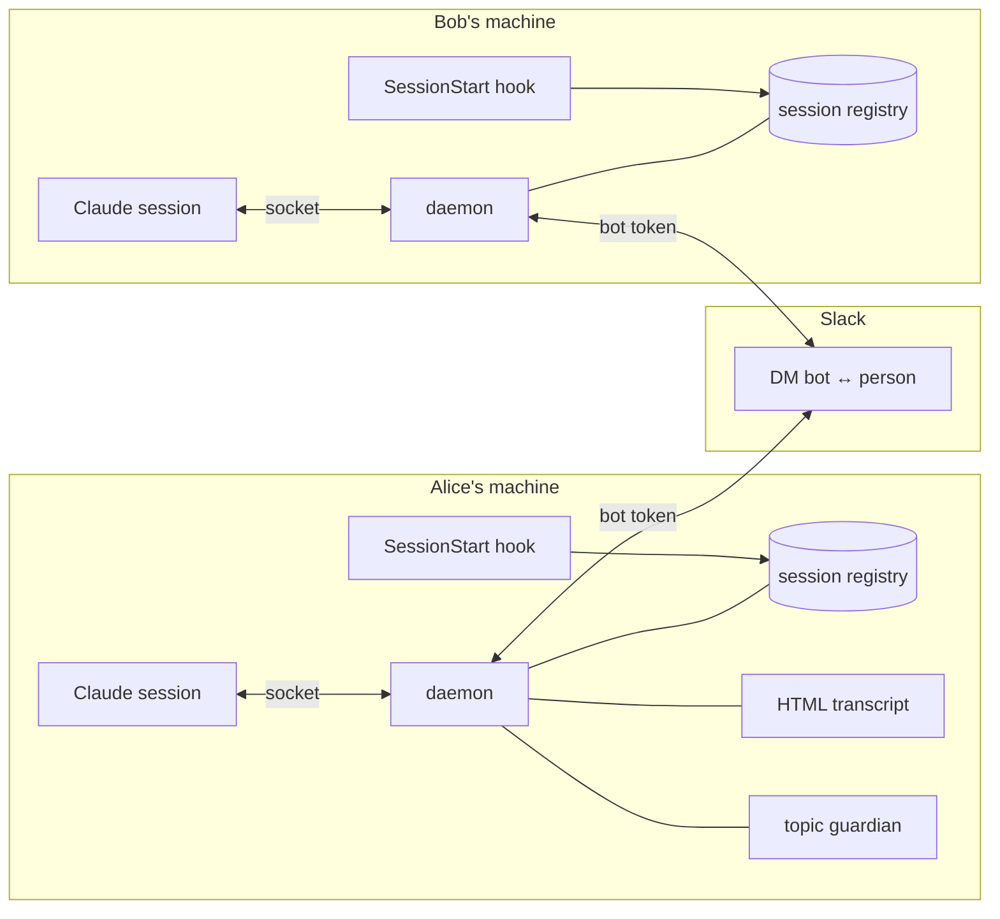

<p align="center">
  
</p>

<h1 align="center">spochie</h1>

<p align="center">
  A tunnel between your Claude Code session and a teammate's.<br>
  Your Claude asks theirs, theirs reads its own files and answers. Slack notifies and keeps the thread.
</p>

<p align="center">
  <a href="#install">Install</a> ·
  <a href="#how-it-works">How it works</a> ·
  <a href="#what-its-for">What it's for</a> ·
  <a href="#usage">Usage</a> ·
  <a href="#rules-that-are-built-not-written">Rules</a> ·
  <a href="#security-model">Security</a> ·
  <a href="#development">Development</a>
</p>

---

## The problem

Two people, two branches, two Claude Code sessions. Bob's session knows why the modal
breaks because it has the code in front of it. Alice's session needs to know. Today that
goes like this: Alice asks her Claude, copies the answer, pastes it to Bob on Slack, Bob
pastes it into his Claude, copies what comes out and sends it back. Four pastes per
question, with the humans as couriers.

spochie removes the pastes. Alice's Claude opens a spochie, Bob's receives it with the
subject and the context, reads **its own local files** and answers. Both humans see it in
a Slack thread and can step in whenever they want. Nobody writes on the other person's
machine, and no tunnel opens until the receiving person says yes.

## Install

One command on the inviter's side, and on the newcomer's side two commands in Claude
Code, a restart, and one paste. No terminal, no Slack login, no tokens to copy, no Slack
permissions to ask for. The only prerequisite is [Bun](https://bun.sh).

The inviter runs:

```
spochie invite --to alex@example.com          # or --to U01234567 --name Alex
```

The bot sends the newcomer a DM with everything inside: the two plugin commands, the
restart, and the line to paste. That line already says who it's for and who sent it, so
the newcomer never has to be looked up in Slack and `@edu` resolves locally afterwards.

The newcomer follows the DM:

```
/plugin marketplace add edugargar/spochie
/plugin install spochie@edugargar
```

restarts Claude Code, and pastes the last line of the DM:

```
/spochie:join eyJiIjoi...
```

Pasting the whole DM works too; the invitation cleans itself out of whatever surrounds
it. At the end it runs `spochie selftest` and prints `Todo bien` or which step failed.

`spochie invite` with no `--to` prints the line for you to send by hand. The invitation
carries the bot token, which belongs to the app and to nobody in particular; on the
newcomer's machine it is stored in `~/.claude/spochie/config.json` with mode 0600.

## How it works



The underlying mechanism is small. Claude Code opens one inbox socket per session and
exports its path and a token:

```
CLAUDE_CODE_MESSAGING_SOCKET=/tmp/cc-socks/<pid>.sock
CLAUDE_CODE_MESSAGING_TOKEN=<token>
```

A local process writes two lines there and the text enters that session as a turn:

```json
{"type":"auth","token":"<token>"}
{"type":"user","message":{"role":"user","content":"..."}}
```

That's the whole thing. The format is not in the public docs: it comes from the Claude
Code binary itself, which prints it as a supported recipe for hooks and scripts. spochie
does not use `channels`, so it depends on nothing in research preview and on no workspace
Owner enabling anything.



Parts:

- **`SessionStart` hook**: registers the session, starts the daemon and claims the
  spochies that arrived while nobody was listening.
- **daemon, one per machine**: the only thing alive between turns, so it keeps the clocks
  and routes. A Claude can't hold a timer; it only exists while it thinks.
- **Slack bridge**: transport between machines, addressing, and the source of truth for
  state.
- **topic guardian**: Haiku labels what drifts off-subject. It never blocks.
- **transcript**: one HTML file per thread, ready to publish as an Artifact.
- **`SessionEnd` hook**: closing the window closes your live spochies.

## What it's for

- **"Why does this break on your branch?"** Your Claude opens a spochie with the subject
  and the touched files. Theirs reads its checkout and answers with the cause, not a guess.
- **A fix that lives on another machine.** The Claude on the other side sends a patch
  (`spochie patch --from-git`) or a branch name. You apply it if it convinces you.
- **A screenshot that says more than a thousand lines.** `--files broken-modal.png`
  uploads it to the thread; the other Claude opens it from its own disk and describes it.
- **Context nobody wrote down.** "What's the flag that disables the cache locally?" Their
  Claude knows because it's in their `.env.example`. Yours doesn't.
- **A thread that stays.** The whole exchange is in Slack for the people and in an HTML
  transcript to read end to end.

## Usage

In practice there's nothing to learn: tell your Claude in plain words, "open a spochie
with Bob about the modal save error". Underneath it runs this:

```
spochie sessions
spochie open <target> --subject "the button breaks" --body "..." [--files a,b]
    target: a local session name, or @person for another machine
spochie accept <id>                  RUN BY THE RECEIVING HUMAN
spochie say <id> "<text>" [--human] [--files a,b]
spochie patch <id> [--from-git | --diff-file f]
spochie branch <id> <branch>
spochie close <id> --reason "..."
spochie list | show <id> | transcript <id>
spochie search "<text>"              across every spochie on this machine
spochie config --human "Alice" --guardian on|off --transcript on|off
```

When someone opens one for you, you get a DM from the bot. Replying in that thread is
accepting. Until you accept, not a single answer leaves your side.

## Rules that are built, not written

Not in a policy document: built, each with its test.

- **The receiving human opens the door.** A `say` before acceptance is rejected with the
  exact command to run. What makes the approval real is Claude Code's permission system:
  keep `spochie accept` out of your allowlist and running it raises the dialog, which
  only the person can approve.
- **Nobody writes on the other machine.** A fix travels as a text patch or a branch, and
  the Claude over there applies it under its own permissions, if it's convinced.
- **The envelope is small**: branch, SHA, touched file names. Nothing else automatic.
  Attaching more is convenient right up to the day a `.env` slips into the envelope.
- **What the other side writes is fenced.** Every message enters between a random marker
  that changes per message, and the receiver's rules always come after the closing
  marker. Without that, a message could write its own headers or imitate spochie's
  instructions.
- **Two clocks**: pending acceptance survives 4 h; live and silent dies at 10 min, with a
  warning at 7. An unread message and an unanswered call are not the same thing.
- **A patch that doesn't fit is refused when sent.** Over Slack a diff travels in 16,200
  characters; anything beyond is not truncated from the end, it is rejected and a branch
  is suggested.
- **The guardian labels, it doesn't cut.** A guardian that blocks ends up cutting the
  good message without anyone knowing why.
- **"delivered" doesn't lie.** Over Slack a message leaves with a delay; until it leaves
  the response says `encolado` (queued), and if publishing fails the sending session is told.

## Security model

Honest version. The real boundary is "whoever holds the bot token is on the team".
Everything else is built on top of that.

What's in place: text-only across machines (patch or branch name, never writes); the
human gate through Claude Code's permission dialog; per-message random fencing of remote
text; downloaded files can't escape the spool (`../` in name or id, tested); a minimal
envelope; config and session records at 0600 with `doctor` complaining otherwise; both
timeouts; no secrets in this repo.

What you should know:

- **One bot token for the whole team**, distributed in the invitation. Whoever holds it
  can read the bot's DM with anyone and post as the bot. When someone leaves, rotate it
  and send a fresh invitation. That is the price of "one paste" onboarding; per-person
  OAuth (`xoxp`) is still supported via `spochie slack setup` for teams that want it.
- **The envelope's `from` is not verified** beyond holding the token. Fine among
  colleagues, not beyond.
- **Remote text enters your session as a turn.** The fence stops it from posing as a
  header or as spochie's rules, but a persuasive message is still a persuasive message.
  Run Claude Code with normal permissions, not bypass, on machines that use spochie.
- **Slack sees everything**: patches and screenshots travel in the clear through Slack,
  like anything else you already paste there. The guardian sends each message to Haiku
  for labelling; `spochie config --guardian off` turns that off.
- **The daemon's local socket has no auth.** Any process running as your user can ask it
  to inject text into your sessions. On a single-user machine that's the same boundary as
  your own processes; on a shared box it isn't.

## Slack, inside

Everything goes through the **DM between the bot and each person**. That DM is the same
channel seen from both sides, so each machine polls exactly one channel for what arrives,
plus one thread per open spochie.

The app needs `chat:write`, `im:write`, `im:read` and `im:history` as bot scopes. That's
all for the normal path: `spochie invite --to` resolves the newcomer on the inviter's
side, and the invitation carries both ids, so nobody is looked up in Slack afterwards.
`users:read` and `users:read.email` (bot scopes) are only needed to invite by email or
by name instead of by Slack id, and for `@someone` who isn't in your local contacts.
No user token is needed for anything.

Alternatives I tried and dropped, with the measurement:

- **Socket Mode**: with several connections from the same app, Slack delivers each event
  to ONE of them. A spochie for Bob could be grabbed by Alice's daemon.
- **Walking your DMs looking for the header**: the first version, and it fell over on the
  first real account. 197 DMs, `conversations.history` is Tier 3, and Slack returned
  `ratelimited` on the second channel.

`conversations.replies` and `conversations.history` are Tier 3: about 50 per minute **per
method and per app**, shared by the whole team. So each daemon caps itself: at most 4
threads per tick, round-robin, and the inbox is polled every 15 s with a live conversation
and every 60 s at rest. For 15 people with two conversations at once that's about 21
`history` and 24 `replies` calls per minute. On a 429, `Retry-After` is honoured and
everything stops.

## Screenshots and files

`--files a.png,b.diff` on `open` or `say`. Within one machine they travel as absolute
paths and the Claude across opens them under its permissions. Across machines the bot
uploads them to the thread and the daemon on the other side downloads them to its own
spool, so what that session receives is a path that exists on **its** disk. 10 MB cap:
spochie is for clues, not for moving binaries.

## The transcript

It republishes itself. The daemon keeps the HTML current but can't publish an Artifact,
which is a tool of the Claude session, so the republish request rides along with the turn
that session is already receiving. The one who opened the spochie publishes it.

## Checking it works

```
spochie selftest     walks the whole loop here, needing nobody and never touching Slack
spochie doctor       reviews what has to be right in order to deliver
```

`selftest` spins up two fake inboxes and goes through the same stops as a real spochie:
the approval gate, the round trip, the close. A step that depends on a broken one is
marked untested, never passed.

`doctor` exists because this tool's failures are silent by nature: an expired token, a
file with loose permissions or a dead daemon don't error, they just make the message not
arrive and nobody notices.

## What it doesn't do

- More than two participants. Deliberate: a spochie is a pair.
- The daemon doesn't survive a reboot. The first hook starts it, which is enough: with
  no session, there's nothing to deliver. `launchd/` has a plist if you want it always on.

## Development

```
bun test                                # 84 tests, no network
SPOCHIE_HOME=/tmp/x bun run src/daemon.ts
```

`SPOCHIE_HOME` isolates all state. It's needed because `os.homedir()` in Bun does **not**
honour `$HOME`, so isolating tests by `HOME` doesn't work: they wrote into the real
`~/.claude`.

```
src/
  cli.ts        the commands
  daemon.ts     clocks, routing, delivery
  slack.ts      the bridge: discovery, threads, call budget
  threads.ts    the envelope, the fence, the limits
  outbox.ts     merges consecutive messages before publishing
  alta.ts       builds and reads invitations
  selftest.ts   the whole loop, locally
  doctor.ts     what has to be right
commands/       /spochie and /spochie:join
hooks/          SessionStart and SessionEnd
scripts/        assistants for the things only a person can do
```

The CLI speaks Spanish; that's where it was born. Manual install without the plugin:
`hooks/session-start.sh` and `hooks/session-end.sh` do the same as `hooks/hooks.json`,
for wiring from your `~/.claude/settings.json`.

---

<p align="center"><sub>Named after Poochie, the dog they added to Itchy &amp; Scratchy to make it "cooler". The joke here is that this one actually does something.</sub></p>
